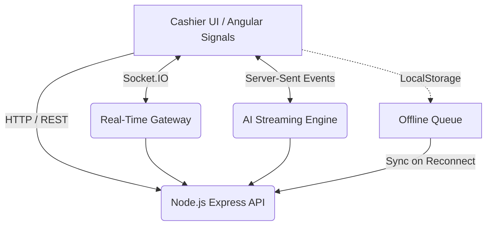

# 🍽️ Smart Restaurant POS (Point of Sale)

<div align="center">
  
  
  
  
</div>

<br/>

A modern, real-time, and AI-powered Point of Sale (POS) system built for smart restaurants. It features a completely event-driven architecture, robust offline-sync capabilities, and an AI assistant to empower cashiers with smart suggestions.

## ✨ Key Features

- **⚡ Real-Time Kanban Orders**: Live order tracking via Socket.IO with drag-and-drop status updates.
- **🛒 Integrated Cart & Smart Search**: Blazing fast debounced product search with keyboard navigation and integrated cart management.
- **🤖 AI Assistant (SSE)**: ChatGPT-like streaming assistant that provides allergy warnings and upselling suggestions based on the current order using Server-Sent Events.
- **🍳 Kitchen Load Monitor**: Automatically flags delayed orders and calculates expected preparation times based on real-time kitchen stress.
- **📶 Offline-First & Idempotency**: Never lose an order. Actions are queued locally during network outages and synced automatically when back online, guaranteeing no duplicate processing (Idempotency Keys).
- **🚀 High Performance**: Built with **Angular Signals** (No NgRx boilerplate), Standalone Components, and `ChangeDetectionStrategy.OnPush` for instant UI updates.

## 🏗️ Architecture



## 🛠️ Technology Stack

* **Frontend**: Angular (Standalone Components, Signals, RxJS).
* **Backend**: Node.js, Express.
* **Real-time**: Socket.IO, Server-Sent Events (SSE).
* **Styling**: SCSS, CSS Variables, Material Symbols.

## 🚀 Getting Started

### Prerequisites
- Node.js (v18 or higher)
- npm or yarn

### Installation

1. **Clone the repository**
   ```bash
   git clone https://github.com/your-username/smart-restaurant-pos.git
   cd smart-restaurant-pos
   ```

2. **Install Dependencies**
   ```bash
   # Install frontend dependencies
   npm install

   # Install backend dependencies
   cd server
   npm install
   cd ..
   ```

3. **Start the Application**
   You can start both the frontend and the mock backend server using the following commands:
   ```bash
   # Terminal 1: Start the backend server (API & WebSockets & AI Stream)
   npm run start:api

   # Terminal 2: Start the Angular frontend
   npm run start
   ```

4. **Access the App**
   Open your browser and navigate to `http://localhost:4201`.

## 📁 Project Structure

```text
├── docs/                      # System documentation & Architectural decisions
├── server/                    # Node.js Mock Backend & Simulator
│   ├── src/routes/            # REST API endpoints
│   ├── src/socket/            # Socket.IO Gateway & Restaurant Simulator
│   └── index.ts               # Server entry point
├── src/
│   ├── app/
│   │   ├── core/              # Interceptors, Guards, and singletons
│   │   ├── features/          # Independent modules (Orders, Kitchen, AI, Offline, Search)
│   │   └── shared/            # Reusable UI components (Dialogs, Navbars)
│   └── styles.scss            # Global styles and CSS variables
```

## 🧠 Design Patterns Used

- **Event-Driven UI**: Zero polling. UI updates reactively based on pushed events from the backend.
- **Idempotency Keys**: Network requests are tagged with UUIDs to prevent double-billing or duplicated state changes during flaky internet connections.
- **Debouncing**: Network request optimization on the search bar using RxJS.

## 📜 License

This project is licensed under the MIT License - see the LICENSE file for details.
