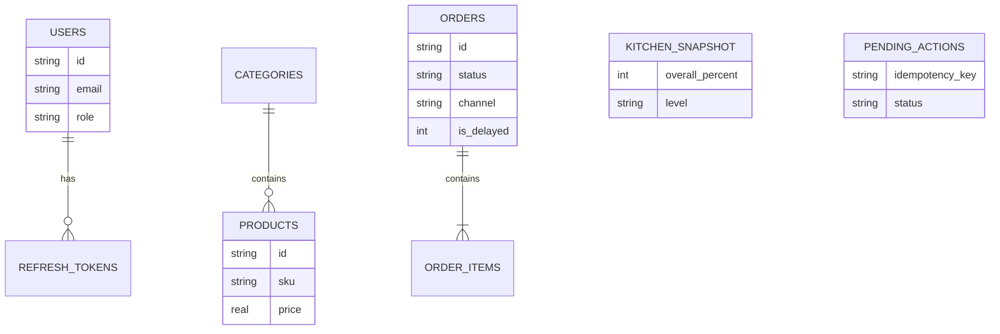

# GourmetOS — Architecture (Phase 1 Backend)

## Why this shape

```
Angular (presentation + feature stores)
        │ HTTP REST                 │ Socket.IO
        ▼                           ▼
Express API  ─────────────────── EventBus ─── Simulation timers
        │
   better-sqlite3 (WAL)
```

- **REST** for explicit commands (login, patch status, search, AI stream)
- **Socket.IO** for push fan-out (orders/kitchen/AI/notifications)
- **SQLite** for durable demo data + ER clarity in interviews
- **Zod** at the HTTP boundary (never trust client payloads)
- **Feature stores stay pure** — they consume `RealtimeEnvelope`, not transport details

## Alternatives considered

| Option | Verdict |
|--------|---------|
| Keep only in-memory mocks | Rejected for hiring depth |
| Full NestJS | Overkill for quest timeline |
| NgRx Global Store | Deferred; Signals+RxJS facades scale first |
| Angular 20 upgrade now | Deferred until API wiring is green |

## ER (logical)



## Run

```bash
# terminal 1
npm --prefix server run dev

# terminal 2
npm start
```

Demo login: `manager@gourmetos.local` / `Password123!`

## Socket events

`order.created` · `order.updated` · `order.status` · `kitchen.updated` · `notification.created` · `ai.started` · `ai.streaming` · `ai.completed`
