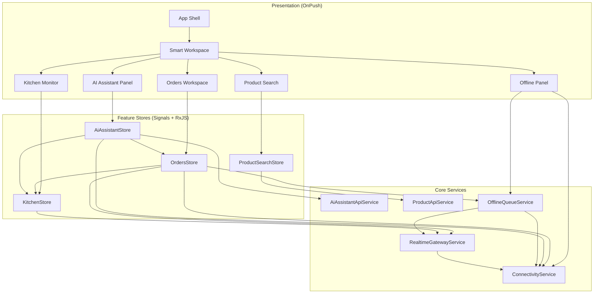

# Architecture

## Data flow highlights

1. **Live orders:** Gateway emits envelopes → `OrdersStore` patches signals → OnPush list re-renders only affected bindings.
2. **Kitchen coupling:** Kitchen snapshot delayed IDs → orders computed view upgrades priority badges without imperative refreshes.
3. **AI:** Order selection effect → cancel previous stream → retryable streaming API → suggestion list grows incrementally.
4. **Search:** Input → debounce → switchMap cancels races → highlighted results + keyboard index.
5. **Offline:** Optimistic patch → enqueue with idempotency key → sync on reconnect.
